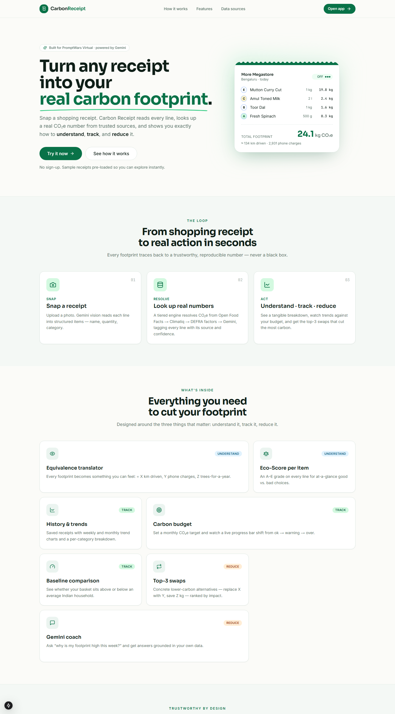
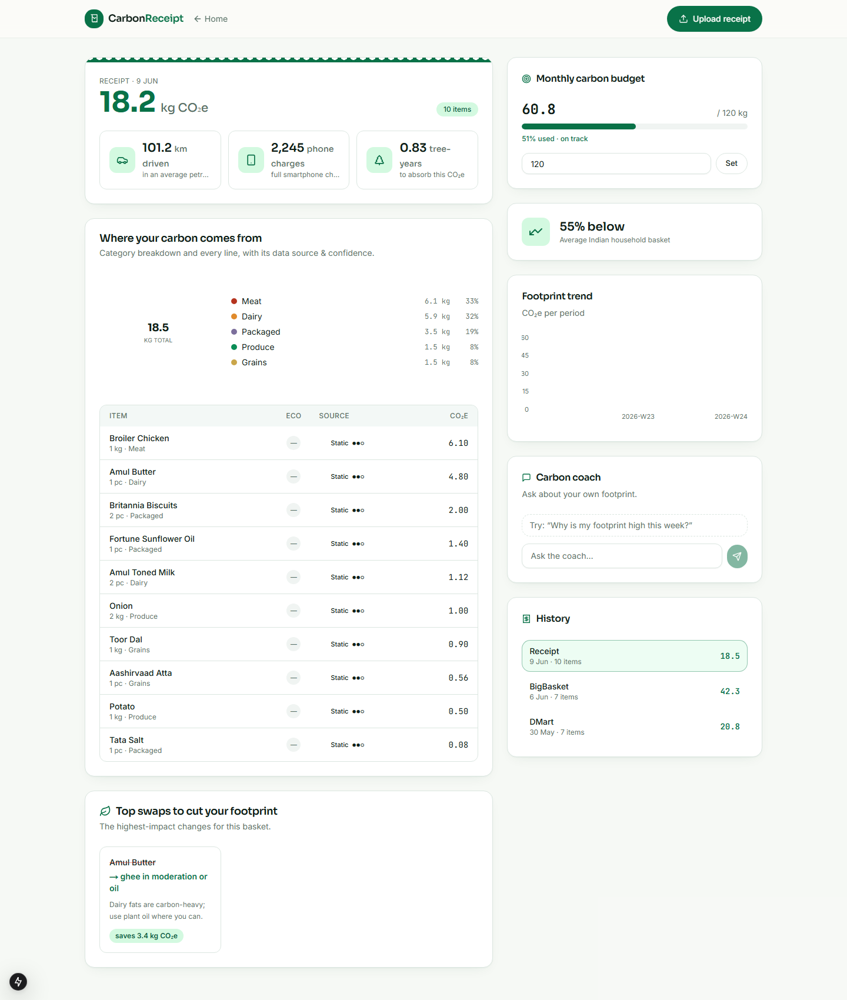

<div align="center">

# 🌱 Carbon Receipt

**Turn an everyday shopping receipt into a real carbon footprint — then understand, track, and reduce it.**

Built for the **PromptWars Virtual** hackathon · *"Help individuals understand, track, and reduce their carbon footprint through simple actions and personalized insights."*

[](https://github.com/Dawn-Of-Justice/CarbonRecipt/actions/workflows/ci.yml)
[](https://nextjs.org/)
[](https://fastapi.tiangolo.com/)
[](https://cloud.google.com/vertex-ai)
[](#-license)

</div>

---

## The idea

Most carbon trackers ask you to log activities by hand, or give you vague averages. **Carbon Receipt skips the busywork:** you snap a grocery receipt, Gemini reads every line, and a tiered lookup engine resolves a **real CO₂e number** for each item — sourced from actual emissions databases, not a black box. You get a tangible breakdown, track it against a personal budget, and see the swaps that cut the most carbon, with a Gemini coach to explain it all in plain language.

The app hits all three theme verbs explicitly:

| Verb | How |
|------|-----|
| **Understand** | Every footprint is translated into something tangible — *"= X km driven / Y phone charges / Z trees needed for a year."* Each line item is tagged with its data **source** + **confidence** so the number is trustworthy, not magic. |
| **Track** | Saved receipt history, weekly/monthly trend chart, per-category breakdown, and a baseline comparison vs. an average household basket. |
| **Reduce** | Top-3 emitters each paired with a concrete lower-carbon swap and the kg CO₂e it saves, plus a monthly **carbon budget** with a live progress bar. |

## Screenshots

| Landing | Dashboard |
|---------|-----------|
|  |  |

## How it works

```
Receipt photo
  → Gemini (Vertex AI, multimodal)  ── extract line items as JSON {name, category, quantity, unit}
  → Carbon lookup engine (tiered)   ── resolve real CO₂e per item, tag source + confidence
  → Aggregate                       ── total CO₂e, per-category breakdown, history
  → Insights                        ── equivalences · top-3 swaps · budget · Gemini coach
```

### The carbon lookup hierarchy (the core design decision)

For each parsed item the engine falls through four tiers and **tags every line with its source + a confidence level** — so the user always knows how real the number is:

1. **Open Food Facts** — real per-product carbon footprint + Eco-Score (A–E), matched by name/barcode. *Best, real number. Free, ODbL.*
2. **Climatiq** — activity/category emission factors (DEFRA/EPA sourced) for items not in OFF.
3. **Static factor table** — bundled DEFRA / Agribalyse / EPA values. Always available, fully offline.
4. **Gemini estimate** — last resort only, so the app is never blank. Clearly flagged as estimated, *never* the primary source.

> Deterministic sources (1–3) are preferred for trustworthy, reproducible numbers. Gemini is the fallback, not the engine.

## Tech stack

| Layer | Choice |
|-------|--------|
| **Frontend** | Next.js 15 (App Router) · TypeScript · Tailwind · shadcn/ui · Recharts |
| **Backend** | Python · FastAPI · Uvicorn |
| **AI** | Gemini `2.5-flash` on **Vertex AI** (vision parsing, coach, tier-4 estimates) |
| **Data** | Open Food Facts · Climatiq · DEFRA/Agribalyse static factors |
| **Persistence** | In-memory by default (zero setup) · optional Firestore |
| **Deploy** | Two Cloud Run services (Dockerfiles included) |

Built with **Google Antigravity** (prompt-driven development), per the hackathon requirement.

## Quick start (Windows PowerShell)

**One command** — opens backend + frontend in two windows, installs deps on first run:

```powershell
./run-local.ps1
```

Then open **http://localhost:3000**. Stop with `./stop-local.ps1`.

<details><summary>Manual start</summary>

```powershell
# Backend  → http://localhost:8000
cd backend
python -m venv venv
./venv/Scripts/python.exe -m pip install -r requirements.txt
Copy-Item .env.example .env
./venv/Scripts/python.exe -m uvicorn app.main:app --reload --port 8000

# Frontend → http://localhost:3000  (new terminal)
cd frontend
npm install
Copy-Item .env.local.example .env.local
npm run dev
```
</details>

### Prerequisites
- **Python 3.10+**, **Node 20+**, **gcloud CLI**.
- Vertex AI access: `gcloud auth application-default login`
  (project `promptwars-495213`, region `us-central1`). Default model: **`gemini-2.5-flash`**.
- The backend **seeds 2 demo receipts** on first run, so the dashboard is alive immediately — no upload required to demo.

## Quality & tests

CI runs on every push/PR (`.github/workflows/ci.yml`): backend **ruff + mypy + pytest**,
frontend **eslint + tsc + vitest + build**. Install the matching pre-commit hooks with
`pip install pre-commit && pre-commit install`.

```powershell
# Backend: lint, type-check, test (offline; Gemini + HTTP mocked)
cd backend
./venv/Scripts/python.exe -m ruff check app tests
./venv/Scripts/python.exe -m mypy app
./venv/Scripts/python.exe -m pytest -q --cov=app

# Frontend: lint, type-check, unit tests
cd frontend
npm run lint
npm run typecheck
npm run test

# Cross-service contract tests against a running backend (start it first)
backend/venv/Scripts/python.exe -m pytest tests/contract_test.py
```

Sample receipt images live in `fixtures/*.png` (regenerate with `python fixtures/generate_receipts.py`).

## Deploy (Cloud Run)

Target GCP project **`promptwars-495213`**, region `us-central1`. Deploy either with the
manual `gcloud` commands or the keyless GitHub Actions workflow — full steps (including the
Workload Identity Federation setup) are in **[docs/DEPLOY.md](docs/DEPLOY.md)**.

```powershell
# Manual quick path (deploy API first; its URL is baked into the web build)
gcloud run deploy carbon-receipt-api --source backend --region us-central1 `
  --allow-unauthenticated --set-env-vars GOOGLE_CLOUD_PROJECT=promptwars-495213,GEMINI_MODEL=gemini-2.5-flash
# then build/deploy the web image with NEXT_PUBLIC_API_BASE_URL set to the API URL (see docs/DEPLOY.md)
```

## Project layout

```
backend/    FastAPI app — carbon engine, Gemini, routers, store, tests
frontend/   Next.js app — landing + dashboard, shadcn/ui, Recharts
fixtures/   Sample Indian grocery receipt images + parsed line items
tests/      Cross-service API contract tests
docs/       API_CONTRACT.md (shared interface spec) + screenshots
```

## Data sources

Open Food Facts (ODbL) · Climatiq · DEFRA / Agribalyse static factors · Gemini (Vertex AI).

## License

MIT — see below. Emission data retains its respective source licenses (Open Food Facts is ODbL).

---

<div align="center">
<sub>Built for PromptWars Virtual 2026 · <a href="https://github.com/Dawn-Of-Justice/CarbonRecipt">Dawn-Of-Justice/CarbonRecipt</a></sub>
</div>
